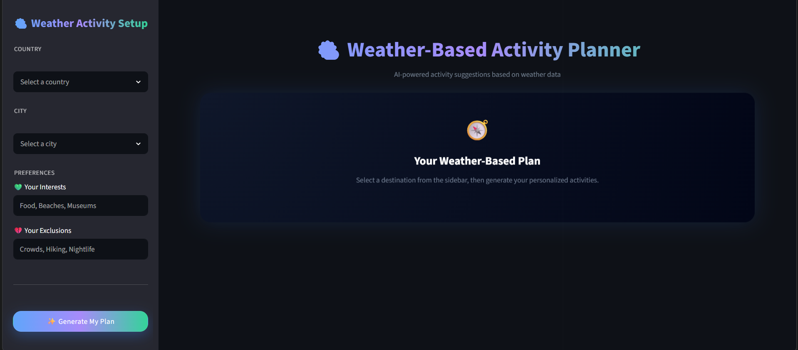

# Weather-Based AI Travel Planner

An AI-powered travel planning application that combines real-time weather data and user preferences to generate personalized, weather-aware, and location-specific experiences. The system focuses on creating meaningful recommendations rather than generic tourist suggestions.

## Project Overview

The application allows users to:

- Select a country and city.
- Provide personal preferences (likes and dislikes).
- Retrieve live weather information.
- Generate personalized activities using AI.
- Evaluate recommendation quality.
- Produce fallback recommendations when necessary.
- Display ranked experiences through an interactive Streamlit interface.

# Features

- Real-time weather integration using OpenWeatherMap
- AI-powered hyper-local travel recommendations
- Preference-based personalization (likes & dislikes)
- Multi-agent architecture (generation, evaluation, fallback)
- Weather-aware planning (heat, wind, conditions)
- Ranking system for best experiences
- Streamlit interactive UI

# System Architecture

The system follows a multi-agent architecture:

```text
User Input
     ↓
Weather Service
     ↓
Activity Agent
     ↓
Quality Evaluation
     ↓
Evaluator Agent
     ↓
Fallback Agent
     ↓
UI Presentation
```
## Tech Stack

- Python
- Streamlit
- OpenAI API
- OpenWeatherMap API
- Plotly
- python-dotenv
- GeonamesCache

## 🔑 Environment Variables 

```markdown
## Environment Variables

Create a `.env` file:

OPENAI_API_KEY=your_key
OPENWEATHER_API_KEY=your_key

## Run

```bash
 python -m streamlit run app\ui.py

# Author

**Nour Sawan**

AI-powered applications built with Python, Streamlit, and Large Language Models.

## 📸 App Preview

